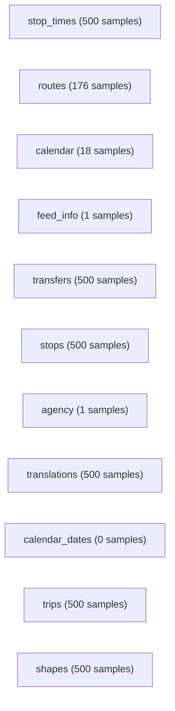

# Database Schema Documentation

Generated on 2025-11-19T15:46:07.628Z

**Database:** RTA

**Sample size per collection:** up to 500 documents, details per collection below.

---

## Collections

### stop_times

Sampled documents: 500

| Field | Types (inferred) | Example(s) | Occurrences in sample |
|---|---|---|---:|
| `_id` | ObjectId | `685ef3c917ca32260e67b1f7 | 685ef39e17ca32260e62df26 | 685ef3bd17ca32260e666ce2` | 500 |
| `trip_id` | string | `64:1:51300:7918:6 | 6014:8:53700:2061:1 | 6051:1:33720:65:5` | 500 |
| `arrival_time` | string | `15:25:00 | 15:32:30 | 10:08:00` | 500 |
| `departure_time` | string | `15:25:00 | 15:32:30 | 10:08:00` | 500 |
| `stop_id` | number | `954001 | 877002 | 427001` | 500 |
| `stop_sequence` | number | `32 | 20 | 22` | 500 |
| `pickup_type` | number | `0 | 1` | 500 |
| `drop_off_type` | number | `0 | 1` | 500 |
| `shape_dist_traveled` | number | `27744 | 8258 | 12808` | 500 |
| `stop_headsign` | string | `Ras Al Khor | Al Nahda MS | Oud Metha Bus Stn` | 464 |

### routes

Sampled documents: 176

| Field | Types (inferred) | Example(s) | Occurrences in sample |
|---|---|---|---:|
| `_id` | ObjectId | `685ef2c417ca32260e51b4c5 | 685ef2c417ca32260e51b4b5 | 685ef2c417ca32260e51b55d` | 176 |
| `route_id` | number | `2005 | 1027 | 97` | 176 |
| `agency_id` | number | `1` | 176 |
| `route_short_name` | string, number | `C03 | SH1 | 97` | 176 |
| `route_long_name` | string | `Al Karama Bus Stn - Abu Hail MS | Dubai Mall MS - Sobha Hartland | Al Qusais Bus Stn - Jebel Ali Ind'l Area 7` | 176 |
| `route_type` | number | `3` | 176 |
| `route_color` | string | `E4B929 | 6F2E90 | D27827` | 176 |
| `route_text_color` | number, string | `0 | FFFFFF` | 176 |

### calendar

Sampled documents: 18

| Field | Types (inferred) | Example(s) | Occurrences in sample |
|---|---|---|---:|
| `_id` | ObjectId | `685ef28f17ca32260e51b492 | 685ef28f17ca32260e51b494 | 685ef28f17ca32260e51b48c` | 18 |
| `service_id` | string, number | `TA | 4 | UP` | 18 |
| `monday` | number | `1 | 0` | 18 |
| `tuesday` | number | `1 | 0` | 18 |
| `wednesday` | number | `1 | 0` | 18 |
| `thursday` | number | `1 | 0` | 18 |
| `friday` | number | `1 | 0` | 18 |
| `saturday` | number | `1 | 0` | 18 |
| `sunday` | number | `1 | 0` | 18 |
| `start_date` | number | `20250627` | 18 |
| `end_date` | number | `20251231` | 18 |

### feed_info

Sampled documents: 1

| Field | Types (inferred) | Example(s) | Occurrences in sample |
|---|---|---|---:|
| `_id` | ObjectId | `685ef2b217ca32260e51b49a` | 1 |
| `feed_publisher_name` | string | `Road and Transport Authority (RTA)` | 1 |
| `feed_publisher_url` | string | `http://www.rta.ae` | 1 |
| `feed_lang` | string | `EN` | 1 |

### transfers

Sampled documents: 500

| Field | Types (inferred) | Example(s) | Occurrences in sample |
|---|---|---|---:|
| `_id` | ObjectId | `685ef79417ca32260e6a61eb | 685ef79417ca32260e6a62d6 | 685ef79417ca32260e6a6254` | 500 |
| `from_stop_id` | number | `13702 | 17501 | 16102` | 500 |
| `to_stop_id` | number | `13701 | 13602 | 16101` | 500 |
| `transfer_type` | number | `3 | 2` | 500 |
| `min_transfer_time` | number | `180 | 300 | 120` | 427 |

### stops

Sampled documents: 500

| Field | Types (inferred) | Example(s) | Occurrences in sample |
|---|---|---|---:|
| `_id` | ObjectId | `685ef77217ca32260e6a5c72 | 685ef77217ca32260e6a584b | 685ef77217ca32260e6a58a1` | 500 |
| `stop_id` | number | `169102 | 966501 | 458502` | 500 |
| `stop_name` | string | `Can Pack Middle East 2 | Rashidiya, Street 38 | Al Warqaa E-21` | 500 |
| `stop_lat` | number | `24.97859 | 25.226483 | 25.19508` | 500 |
| `stop_lon` | number | `55.17758 | 55.390576 | 55.405059` | 500 |
| `zone_id` | number | `1 | 5 | 4` | 500 |
| `stop_code` | string, number | `CPME2 | RS381 | AWQE2` | 500 |
| `location_type` | number | `0` | 482 |

### agency

Sampled documents: 1

| Field | Types (inferred) | Example(s) | Occurrences in sample |
|---|---|---|---:|
| `_id` | ObjectId | `685ef26617ca32260e51b484` | 1 |
| `agency_id` | number | `1` | 1 |
| `agency_name` | string | `Road and Transport Authority (RTA)` | 1 |
| `agency_url` | string | `http://www.rta.ae` | 1 |
| `agency_timezone` | string | `Asia/Dubai` | 1 |
| `agency_lang` | string | `EN` | 1 |
| `agency_phone` | number | `8009090` | 1 |

### translations

Sampled documents: 500

| Field | Types (inferred) | Example(s) | Occurrences in sample |
|---|---|---|---:|
| `_id` | ObjectId | `685ef7ed17ca32260e6d8859 | 685ef7ed17ca32260e6d78b1 | 685ef7ea17ca32260e6d2329` | 500 |
| `table_name` | string | `stop_times` | 500 |
| `field_name` | string | `stop_headsign` | 500 |
| `language` | string | `ar` | 500 |
| `translation` | string | `محطة حافلات ديرة سيتي سنتر | رأس الخور | محطة مترو برجمان` | 500 |
| `record_id` | string | `2004:15:37500:17:5 | 5006:3:34080:99:5 | 6051:1:48600:62:5` | 500 |
| `record_sub_id` | number | `30 | 5 | 8` | 500 |

### calendar_dates

Sampled documents: 0

| Field | Types (inferred) | Example(s) | Occurrences in sample |
|---|---|---|---:|

### trips

Sampled documents: 500

| Field | Types (inferred) | Example(s) | Occurrences in sample |
|---|---|---|---:|
| `_id` | ObjectId | `685ef7b017ca32260e6af6ea | 685ef7b217ca32260e6b324e | 685ef7b217ca32260e6b4396` | 500 |
| `route_id` | number | `15 | 6023 | 93` | 500 |
| `service_id` | number | `5 | 4 | 3` | 500 |
| `trip_id` | string | `15:20:76500:9093:5 | 6023:1:54600:3190:4 | 93:7:47100:3240:3` | 500 |
| `shape_id` | string | `15:20 | 6023:1 | 93:7` | 500 |
| `trip_headsign` | string | `Al Quoz Al Khail Gate | Al Satwa | Mall Of  Emirates Bus Stn` | 500 |
| `direction_id` | number | `0 | 1` | 500 |
| `block_id` | number | `9093 | 3190 | 3240` | 500 |
| `trip_short_name` | number | `32229 | 47433 | 51857` | 500 |

### shapes

Sampled documents: 500

| Field | Types (inferred) | Example(s) | Occurrences in sample |
|---|---|---|---:|
| `_id` | ObjectId | `685ef2ea17ca32260e53a18a | 685ef2e617ca32260e52fd7f | 685ef2ea17ca32260e539a39` | 500 |
| `shape_id` | string | `6011:2 | 2016:36 | 6008:2` | 500 |
| `shape_pt_lat` | number | `25.164686666666668 | 25.241891666666668 | 25.148235` | 500 |
| `shape_pt_lon` | number | `55.23447 | 55.29848333333333 | 55.228361666666665` | 500 |
| `shape_pt_sequence` | number | `181 | 127 | 314` | 500 |
| `shape_dist_traveled` | number | `7136 | 4835 | 12594` | 500 |

---

## Inferred references (probable relationships)

No references inferred from sampled data. If you suspect relations, increase sample size or ensure ObjectId values are present in the sample.

---

## Entity Relationship Diagram (graph)



---

## Notes, limitations, and recommended next steps

1. This doc is automatically inferred from sampled documents, it is not authoritative unless your app enforces strict schema via Mongoose or validation rules.
2. Increase --sample to scan more documents for better detection, eg --sample=1000.
3. If you use Mongoose models or JSON Schema in your app, prefer exporting those models as canonical schema.
4. Embedded objects and arrays are listed with dotted paths; arrays show subfields under `field[]`.
5. For production ERD and diagrams, consider exporting the Mermaid block into mermaid.live or Mermaid CLI to render SVG/PDF.

---

## How to convert to PDF

Option 1, pandoc:
```bash
pandoc db-schema.md -o db-schema.pdf --pdf-engine=xelatex
```

Option 2, md-to-pdf (node):
```bash
npm i -g md-to-pdf
md-to-pdf db-schema.md -o db-schema.pdf
```

Option 3, upload to GitHub and use GitHub rendering of Mermaid then print to PDF from browser.
